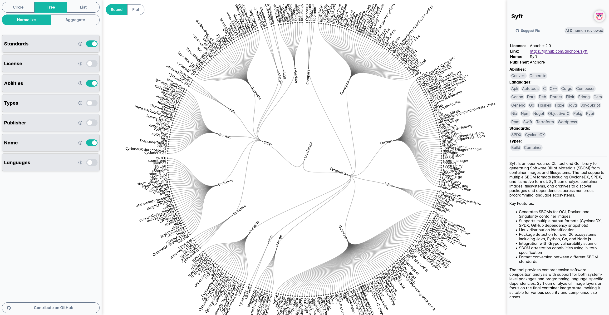

# Introducing a Catalog for SBOMs

For the last year now the SBOM Everywhere SIG was working on a Catalog for tooling thats related to SBOMs. The goal of this catalog is to provide a landscape of tools in a structured way that can be searched and filtered for specific properties. The catalog is available under the following link: [https://sbom-catalog.openssf.org/catalog](https://sbom-catalog.openssf.org/catalog)

### Checking out the Catalog:
The idea behind the Catalog was to make it easy and interactive to use, so someone can discover tools that are interesting for them. On the left are the controls for view, mode and enabled filters. A detailed description of each tool is provided on the right side after selected. Here we provide some structured data about the tools and also a basic description of the tool.

### Selecting the filters:
The filter cards on the left describe the layers of the Plot. It is possible to enable or disable them or also drag and drop them in order to change the layer order. 

**The Standards** describe the Standards that the tools are compatible with. Currently we have tools that are compatible with SPDX and CycloneDX.

**License** describes the license of the tools we could find for the tool. This is not applicable for all tools as some don't use a standardized license or have a proprietary background.

**The Abilities** describe the capabilities of the tool. In what part of the software development lifecycle can the tool be used? The following abilities are supported:
- **Compare**   - *Can compare two SBOMs*
- **Consume**   - *Can use a provided SBOM in some form*
- **Convert**   - *Can Convert between formats (SPDX, CycloneDX), versions or file-formats (json, xml)*
- **Edit**      - *Can somehow edit the contents of a SBOM*
- **Generate**  - *Can automatically generate a SBOM*
- **Merge**     - *Can merge several SBOMs*
- **Validate**  - *Can validate a SBOM against the file schema or requirements like defined by the NTIA*
- **Sign**      - *Can sign a SBOM (according to the signage process of the schema)*

**The Type** Describes in which phase of the software development lifecycle is applicable. We described the diffrent phases in the following blog in more detail https://sbom-catalog.openssf.org/sbom-types.html. The following types are currently supported:
- Design
- Source
- Build
- Analyze
- Deployed
- Runtime
- Container

**The publisher** refers to the company or institution maintaining the tool. 

**The Language** describes the programming language or ecosystem the tool can handle.

### Selecting a view:

The catalog provides three different views on the data, a circle Plot, a Tree Plot and a Table view. Each plot is interactive. The circle view can be discoverd by zooming in and inspect the data as groups and subgroups. Similar the Tree were the diffrent branches group the tools.

| Circle | Tree | List |
|--------|------|------|
|      |     |      |

### Switching between an Normalized view and an Aggregated view:
Switching between the normalized and aggregated view desides if tools should be listed several times in different categories, or if tools are grouped in a certain category that describes their properties. I.e. if a tool like Syft is compatible with SPDX and CycloneDX it would be displayed in both categories in the normalized view. In the aggregated view there would be a group that are compatible with both groups. 

| Normalized | Aggregated |
|------------|------------|
|            |            |

